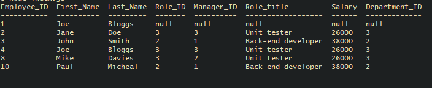

# Employee tracker [](https://opensource.org/licenses/MIT)

## Description

A CLI MySQL database manager for tracking employees

## Table of contents

- [Installation](#installation)
- [Usage](#usage)
- [License](#license)
- [Screenshot](#screenshot)
- [Questions](#questions)
- [Languages](#languages-and-framworks)
- [Video](#video)
- [Question tree](#question-tree)

## Installation
```npm i```

## Usage
run `node index.js` from root dir

## License 
This is covered under The MIT License: 
[](https://opensource.org/licenses/MIT)

## Screenshot



## Questions

If you have any questions you can contact me on: 
jcourtneywork@gmail.com

my github:
https://github.com/jjcourtney/

## Languages and Modules
*  
*  
* 
* **`Inquirer.js`**


## Video
[Walkthrough / user video guide](https://drive.google.com/file/d/1QWBRtUR46IOuiIkutdPjgaykRkoSBuvh/view) 

## Question tree

```
view
    employees
        all > query
        by department 
            which department
                (input) > query
    roles > query
    departments
        all > query
        budget
            (input) > query
add
    employee
        (input) > query
    role
        (input) > query
    department
        (input) > query

update employees'
    manager
        (input) > query
    role
        (input) > query

delete
    departments
        (input) > query
    roles
        (input) > query
    employee
        (input) > query
```